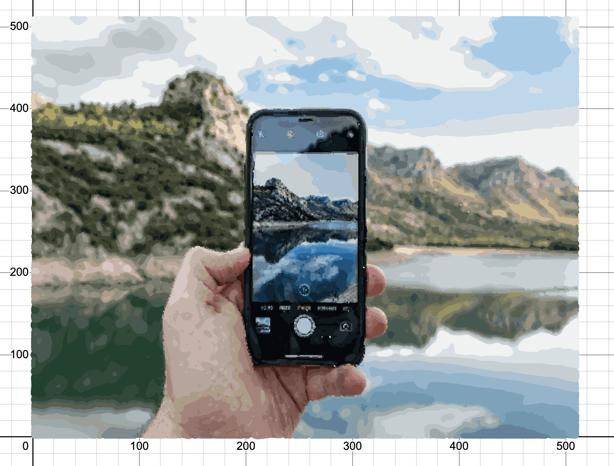

# desmosify
This project turns an image into a graph in [Desmos](https://desmos.com/calculator) using the following steps:

 - Perform k-means clustering on the pixels of the image (using both location and color) to split the image into sections.
 - Turn these clusters into a set of outlines, and turn the outlines into a graph of nodes.
 - Find long cycles formed from outline nodes.
 - Use Fourier Series to turn each outline into a parametric equation which Desmos can draw.

### Example

 

### Usage
	python3 to_desmos.py <image path> [<clusters> <color weight> <blur level>]
 - `<image path>`: path to the image to convert
 - `<clusters>` *(optional, default=120)*: the number of clusters to use for k-means clustering
 - `<color weight>` *(optional, default=1.0)*: how much to consider colors (as opposed to location) of pixels during clustering
 - `<blur level>` *(optional, default=3)*: how much to blur the original image

The output of this program will be stored in *out.txt*.  Copy and paste this file into the JavaScript console on [Desmos](https://desmos.com/calculator) and drag the *a* slider to its maximum value.

*Note: If the image is too large, this program will take too long.*

### Libraries needed
 - numpy
 - matplotlib
 - scipy
 - OpenCV
